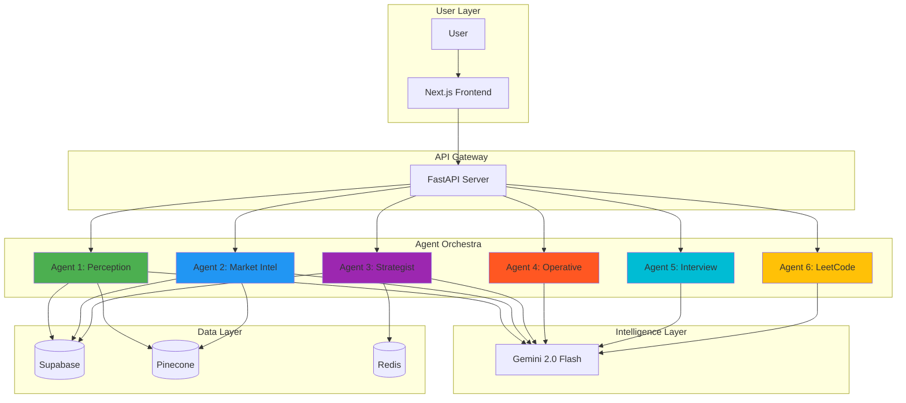
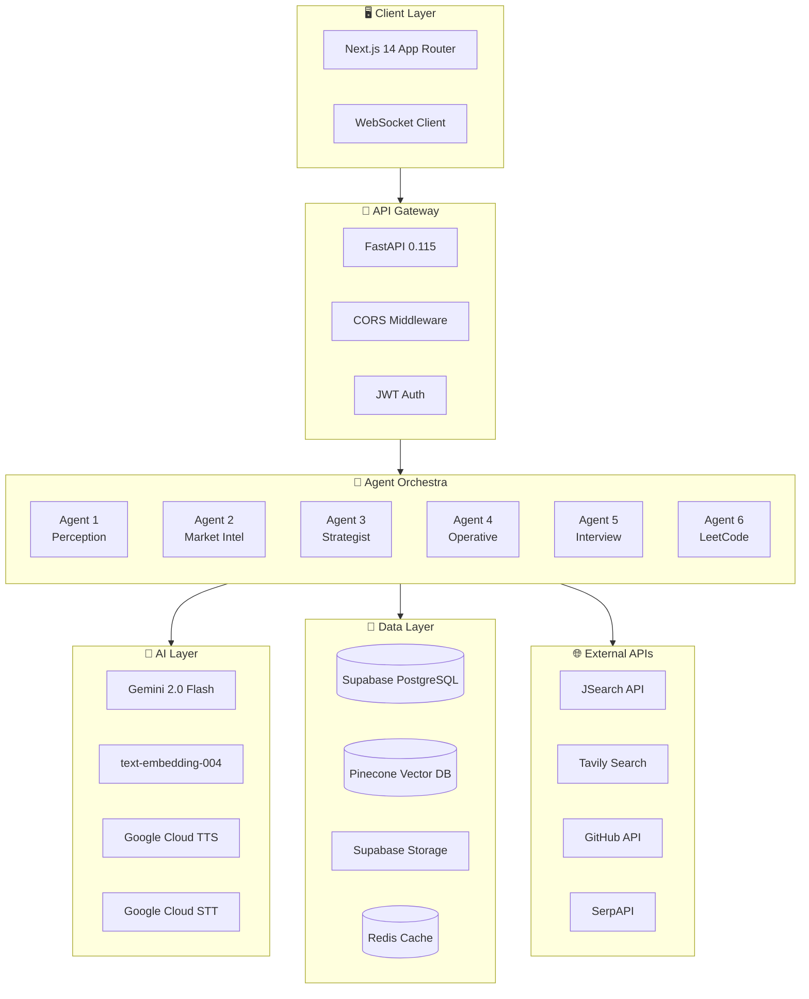
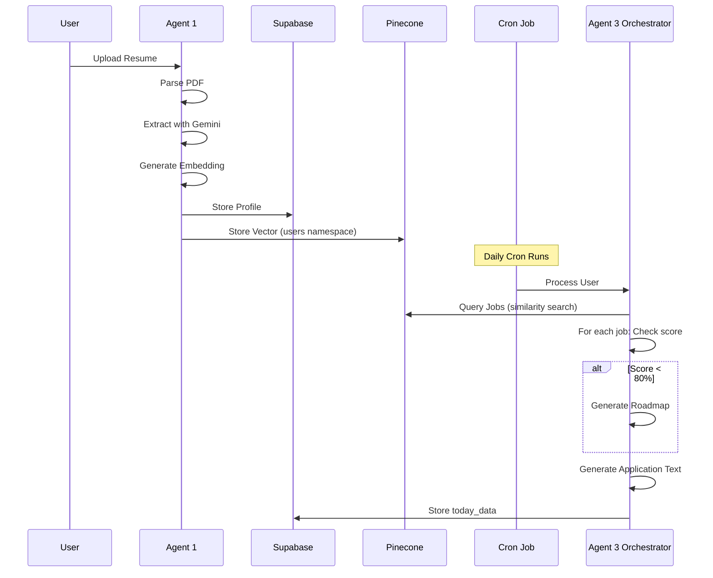
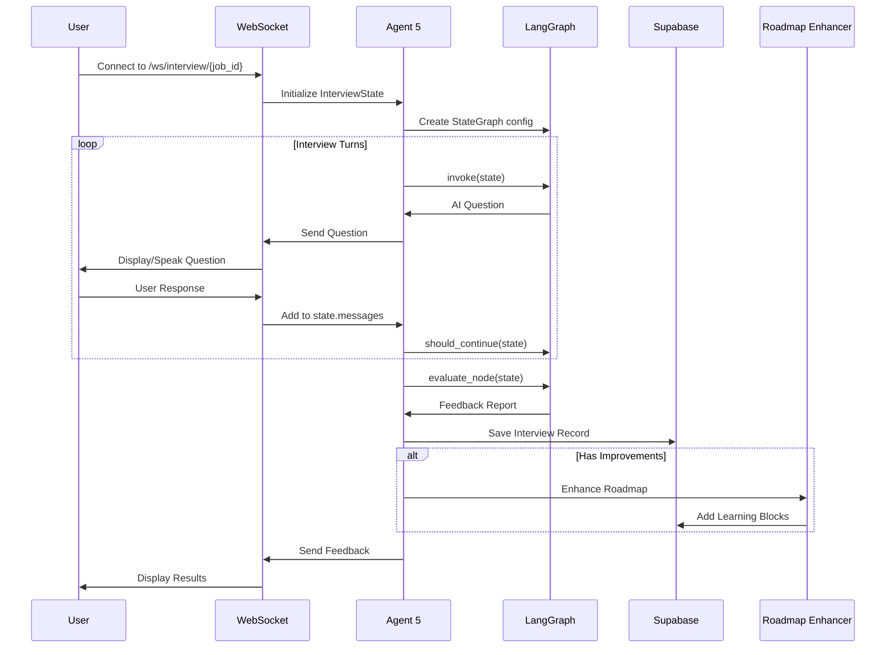

<
2. [Why We Are Truly Agentic](#-why-we-are-truly-agentic)
3. [System Architecture](#-system-architecture)
4. [The Six Autonomous Agents](#-the-six-autonomous-agents)
5. [LangGraph Deep Dive](#-langgraph-deep-dive)
6. [Tech Stack & Infrastructure](#-tech-stack--infrastructure)
7. [Data Pipeline Flow](#-data-pipeline-flow)
8. [Database Architecture](#-database-architecture)
9. [API Design](#-api-design)
10. [Deployment & DevOps](#-deployment--devops)
11. [Security Architecture](#-security-architecture)

---

## 📋 Executive Summary

**Erflog** is a **multi-agent AI career automation system** that transforms how job seekers navigate the modern job market. Unlike traditional job boards or ATS systems, Erflog deploys **six specialized autonomous agents** that work in concert to:

- 🎯 **Perceive** and understand candidate profiles
- 🌐 **Aggregate** global market intelligence
- 🧠 **Strategize** personalized career paths
- ⚡ **Execute** automated applications
- 🎤 **Interview** candidates with AI mock sessions
- 💻 **Train** users with adaptive LeetCode prep



---

## 🤖 Why We Are Truly Agentic

> **"An agent is not just an AI that responds—it's an AI that reasons, plans, acts, and adapts autonomously."**

### Defining Characteristics of Our Agentic Architecture

| Characteristic | How Erflog Implements It |
|----------------|--------------------------|
| **Autonomous Decision-Making** | Agents independently decide when to generate roadmaps, skip processing, or trigger nested workflows |
| **State Management** | LangGraph `StateGraph` maintains conversation history, interview stages, and workflow progress |
| **Tool Usage** | Agents invoke external tools (Pinecone search, Gemini LLM, Browser automation) based on context |
| **Memory & Persistence** | Redis caching, Supabase storage, and LangGraph checkpoints provide short & long-term memory |
| **Multi-Step Planning** | Orchestrator decomposes complex tasks (job enrichment) into DAG nodes executed sequentially |
| **Feedback Loops** | Interview agent triggers roadmap enhancements based on candidate performance |

### LangGraph: The Brain of Our Agents

We use **LangGraph** (from LangChain) as our agentic orchestration framework. Here's proof of our agentic nature:

```python
# From orchestrator.py - Agent 3 Strategist
from langgraph.graph import StateGraph, START, END

def build_orchestrator_graph() -> StateGraph:
    """Build the orchestrator workflow graph."""
    workflow = StateGraph(OrchestratorState)
    
    # Add nodes (each is an autonomous decision point)
    workflow.add_node("enrich_jobs", enrich_jobs_node)
    workflow.add_node("finalize", finalize_node)
    
    # Define edges (state transitions)
    workflow.add_edge(START, "enrich_jobs")
    workflow.add_edge("enrich_jobs", "finalize")
    workflow.add_edge("finalize", END)
    
    return workflow.compile()
```

```python
# From graph.py - Agent 5 Mock Interview
workflow = StateGraph(InterviewState)
workflow.add_node("interviewer", interviewer_node)
workflow.add_node("evaluate", evaluate_node)

# Conditional routing based on state
workflow.add_conditional_edges(
    "interviewer", 
    should_continue, 
    {"continue": "interviewer", "evaluate": "evaluate"}
)
```

### Agent Autonomy in Action

```
┌─────────────────────────────────────────────────────────────────────┐
│                    AGENT DECISION WORKFLOW                         │
│                                                                     │
│   User uploads resume                                               │
│         │                                                           │
│         ▼                                                           │
│   ┌─────────────┐  AUTONOMOUS DECISION                             │
│   │  Agent 1    │  "Should I extract skills or request re-upload?" │
│   │ Perception  │  → Analyzes PDF quality, decides to proceed      │
│   └──────┬──────┘                                                   │
│          │                                                          │
│          ▼                                                          │
│   ┌─────────────┐  AUTONOMOUS DECISION                             │
│   │  Agent 3    │  "Is match score >= 80%?"                        │
│   │ Strategist  │  → NO: Generate learning roadmap                 │
│   └──────┬──────┘  → YES: Skip roadmap, proceed to application     │
│          │                                                          │
│          ▼                                                          │
│   ┌─────────────┐  AUTONOMOUS DECISION                             │
│   │  Agent 5    │  "Has user answered enough questions?"           │
│   │ Interview   │  → Transitions stages, generates feedback        │
│   └─────────────┘                                                   │
└─────────────────────────────────────────────────────────────────────┘
```

---

## 🏗️ System Architecture

### High-Level Architecture



### Project Structure

```
backend/
├── main.py                    # FastAPI entry point
├── Dockerfile                 # Production container
├── docker-compose.yml         # Local dev stack
├── requirements.txt           # Python dependencies
│
├── agents/                    # 🤖 The Six Agents
│   ├── agent_1_perception/    # Resume parsing & skill extraction
│   ├── agent_2_market/        # Job/hackathon/news aggregation
│   ├── agent_3_strategist/    # Semantic matching & roadmaps
│   ├── agent_4_operative/     # Auto-apply & resume mutation
│   ├── agent_5_mock_interview/# Voice/chat interview simulation
│   └── agent_6_leetcode/      # Adaptive coding practice
│
├── auth/                      # 🔐 Authentication
│   └── dependencies.py        # JWT verification
│
├── core/                      # ⚙️ Core Infrastructure
│   ├── config.py              # Environment configuration
│   ├── db.py                  # Database manager
│   ├── redis_client.py        # Redis connection pool
│   └── state.py               # Shared state definitions
│
└── services/                  # 🔧 Shared Services
    └── cache_service.py       # Caching utilities
```

---

## 🔮 The Six Autonomous Agents

### Agent 1: Perception 👁️

> **"I see what you are—your skills, your experience, your potential."**

**Purpose**: The ingestion layer that transforms raw PDF resumes into structured, searchable intelligence.

| Feature | Technology | Description |
|---------|------------|-------------|
| PDF Parsing | `pypdf`, `pdfminer.six` | Extracts text from any resume format |
| Structured Extraction | Gemini 2.0 Flash | Parses into JSON (skills, education, experience) |
| Vector Embedding | `text-embedding-004` | 768-dimensional semantic embeddings |
| Storage | Supabase + Pinecone | Dual-write for SQL queries + vector search |
| ATS Scoring | Custom Engine | Compatibility scoring against ATS rules |
| GitHub Watchdog | GitHub Events API | Real-time skill detection from code activity |

**Data Flow**:
```
PDF Upload → Parse → Gemini Extract → Generate Embedding → Store (Supabase + Pinecone)
                                                            ↓
                                              Calculate ATS Score → Save
```

---

### Agent 2: Market Intelligence 📡

> **"I know the job market before it knows itself."**

**Purpose**: Autonomous daily cron job that aggregates global opportunities from multiple providers.

| Collection Target | Daily Count | Data Sources |
|-------------------|-------------|--------------|
| Jobs | 30 | JSearch, Mantiks, SerpAPI |
| Hackathons | 10-20 | Tavily, SerpAPI (Devpost, Devfolio, MLH) |
| News | 10 | Tavily, NewsData.io, SerpAPI |

**Execution Pipeline**:
```
┌──────────────────────────────────────────────────────────────────────┐
│                     DAILY CRON WORKFLOW                              │
│                                                                      │
│  1. Aggregate user target_roles from all profiles                    │
│  2. LLM optimizes search queries (max 5 roles)                       │
│  3. Provider allocation:                                             │
│     ├── JSearch → Frontend, Backend roles                            │
│     ├── Mantiks → Security, Enterprise roles                         │
│     └── SerpAPI → AI/ML, Web3 roles                                  │
│  4. Fetch + Normalize + Deduplicate                                  │
│  5. Store (Supabase SQL + Pinecone vectors)                          │
│                                                                      │
│  Guarantees: Idempotent | Provider Isolation | Consistent IDs        │
└──────────────────────────────────────────────────────────────────────┘
```

---

### Agent 3: Strategist 🧠

> **"I don't just match keywords—I understand the semantic gap between you and your dream job."**

**Purpose**: The thinking engine that performs semantic matching and generates personalized learning roadmaps.

**Key Features**:
- **Semantic Matching**: Uses cosine similarity on embeddings, not keyword matching
- **Tier Classification**:
  - **Tier A (Ready)**: ≥80% match → No roadmap needed
  - **Tier B (Improvement)**: <80% match → Generates 3-day DAG roadmap
- **Application Text Generation**: Pre-generates cover letters, "Why us?" responses
- **LangGraph Orchestration**: Coordinates multi-step enrichment workflow

**LangGraph Implementation**:
```python
class OrchestratorState(TypedDict):
    user_id: str
    user_profile: Dict[str, Any]
    jobs: List[Dict[str, Any]]
    enriched_jobs: List[Dict[str, Any]]  # With roadmaps + app text
    status: str

# The orchestrator graph
workflow = StateGraph(OrchestratorState)
workflow.add_node("enrich_jobs", enrich_jobs_node)
workflow.add_node("finalize", finalize_node)
workflow.add_edge(START, "enrich_jobs")
workflow.add_edge("enrich_jobs", "finalize")
workflow.add_edge("finalize", END)

orchestrator_graph = workflow.compile()
```

**DAG Roadmap Structure**:
```json
{
  "missing_skills": ["Kubernetes", "GraphQL"],
  "graph": {
    "nodes": [
      {"id": "n1", "label": "K8s Basics", "day": 1, "type": "concept"},
      {"id": "n2", "label": "Deploy App", "day": 2, "type": "practice"},
      {"id": "n3", "label": "CI/CD Pipeline", "day": 3, "type": "project"}
    ],
    "edges": [
      {"source": "n1", "target": "n2"},
      {"source": "n2", "target": "n3"}
    ]
  },
  "resources": {
    "n1": [
      {"name": "Official Docs", "url": "https://kubernetes.io/docs/"},
      {"name": "Video", "url": "https://youtube.com/results?search_query=kubernetes+basics"}
    ]
  }
}
```

---

### Agent 4: Operative 🕵️

> **"I don't just help you apply—I become you and do it for you."**

**Purpose**: The execution agent that automates resume tailoring and job applications.

| Capability | Technology | Description |
|------------|------------|-------------|
| Resume Mutation | Gemini + LaTeX | Rewrites bullets to match JD, renders PDF |
| Auto-Apply Bot | Playwright + browser-use | Fills forms on Ashby, Greenhouse, etc. |
| Response Generator | Gemini | Crafts "Why us?" and custom answers |
| Rejection Analysis | Gemini + Pinecone | Learns from failures, avoids anti-patterns |
| ATS Scorer | Custom Rules | Validates resume compatibility |

**LangGraph Workflow**:
```python
# Agent 4's StateGraph for resume mutation
workflow = StateGraph(Agent4State)
workflow.add_node("mutate", mutate_node)    # Rewrite content
workflow.add_node("render", render_node)    # Generate PDF
workflow.add_node("hunt", hunt_node)        # Find recruiter email
workflow.add_edge(START, "mutate")
workflow.add_edge("mutate", "render")
workflow.add_edge("render", "hunt")
workflow.add_edge("hunt", END)
```

**Resume Mutation Flow**:
```
Original PDF → Extract Text → Gemini Optimize → LaTeX Render → Upload to Storage
                   ↓                                              ↓
            Job Description                              Return tailored_resume_url
```

---

### Agent 5: Mock Interview 🎤

> **"Practice doesn't make perfect—I make practice perfect."**

**Purpose**: AI-powered mock interview system with voice and chat modes, using LangGraph state machine.

**Features**:
- **Mode Toggle**: `text` (chat) or `voice` (real-time audio)
- **Interview Types**: Technical or HR/Behavioral
- **Staged Flow**: Intro → Resume Deep-Dive → Challenge → Conclusion
- **State Persistence**: LangGraph checkpoints maintain conversation history
- **Feedback Loop**: Post-interview improvements enhance user's roadmap

**LangGraph State Machine**:
```python
class InterviewState(TypedDict):
    messages: List[BaseMessage]
    stage: str              # intro, resume, challenge, conclusion, end
    turn: int               # Total turns in interview
    stage_turn: int         # Turns within current stage
    context: dict           # Job + User + Gap analysis
    feedback: Optional[dict]
    mode: str               # 'text' or 'voice'
    interview_type: str     # 'TECHNICAL' or 'HR'

# Conditional routing based on interview progress
def should_continue(state: InterviewState) -> Literal["continue", "evaluate"]:
    if state.get("stage") == "end" or state.get("ending"):
        return "evaluate"
    return "continue"

workflow = StateGraph(InterviewState)
workflow.add_node("interviewer", interviewer_node)
workflow.add_node("evaluate", evaluate_node)
workflow.add_conditional_edges("interviewer", should_continue, {...})
workflow.add_edge("evaluate", END)

# Compile with checkpointer for state persistence
interview_graph = workflow.compile(
    checkpointer=MemorySaver(),
    interrupt_after=["interviewer"]
)
```

**Feedback Loop Integration**:
```
Interview Complete → Evaluate Performance → Extract Improvements
                                                   ↓
                        POST /enhance-roadmap-from-feedback
                                                   ↓
                              Add new learning blocks to Global Roadmap
```

---

### Agent 6: LeetCode Trainer 💻

> **"I adapt to your weaknesses and strengthen your coding foundation."**

**Purpose**: Adaptive LeetCode practice with Blind 75 problems and personalized difficulty scaling.

| Feature | Description |
|---------|-------------|
| Problem Bank | Curated Blind 75 JSON dataset |
| Adaptive Difficulty | Scales based on user performance |
| Progress Tracking | Supabase `leetcode_progress` table |
| Quiz Assessment | Initial skill evaluation |

---

## 🔧 LangGraph Deep Dive

### What is LangGraph?

LangGraph is a library from LangChain for building **stateful, multi-actor applications** with LLMs. It enables:

- **State Machines**: Define nodes (actions) and edges (transitions)
- **Conditional Routing**: Branch based on runtime state
- **Checkpointing**: Persist state for long-running conversations
- **Human-in-the-Loop**: Interrupt and resume workflows

### Our LangGraph Implementations

| Agent | Graph Purpose | Key Features |
|-------|--------------|--------------|
| Agent 3 | Job Enrichment Orchestrator | Sequential processing, roadmap generation |
| Agent 4 | Resume Mutation Pipeline | Mutate → Render → Hunt recruiter |
| Agent 5 | Interview State Machine | Conditional stage transitions, evaluation |

### StateGraph Pattern

```python
from langgraph.graph import StateGraph, START, END
from langgraph.checkpoint.memory import MemorySaver

# 1. Define State Schema
class MyState(TypedDict):
    messages: List
    current_step: str
    result: Optional[dict]

# 2. Define Node Functions
def process_node(state: MyState) -> dict:
    # Autonomous processing logic
    return {"current_step": "next"}

def evaluate_node(state: MyState) -> dict:
    # Decision-making logic
    return {"result": {...}}

# 3. Build Graph
workflow = StateGraph(MyState)
workflow.add_node("process", process_node)
workflow.add_node("evaluate", evaluate_node)
workflow.add_edge(START, "process")
workflow.add_conditional_edges("process", routing_fn, {...})
workflow.add_edge("evaluate", END)

# 4. Compile with Checkpointer
graph = workflow.compile(checkpointer=MemorySaver())

# 5. Invoke
result = graph.invoke(initial_state, config={"configurable": {"thread_id": "..."}})
```

---

## 🛠️ Tech Stack & Infrastructure

### Core Technologies

| Category | Technology | Version | Purpose |
|----------|------------|---------|---------|
| **Framework** | FastAPI | 0.115.0 | Async Python web framework |
| **Runtime** | Uvicorn | 0.30.0 | ASGI server |
| **LLM** | Gemini 2.0 Flash | - | Primary AI inference |
| **Embeddings** | text-embedding-004 | - | 768-dim semantic vectors |
| **Orchestration** | LangGraph | 0.2.60 | Stateful agent workflows |
| **LangChain** | langchain | 0.3.14 | LLM integration framework |

### Data Storage

| Service | Purpose | Key Features |
|---------|---------|--------------|
| **Supabase** | PostgreSQL + Auth + Storage | SQL queries, file storage, RLS |
| **Pinecone** | Vector Database | Semantic search, 768-dim embeddings |
| **Redis** | Caching Layer | Session state, rate limiting |

### External APIs

| API | Provider | Purpose |
|-----|----------|---------|
| JSearch | RapidAPI | Job listings |
| Tavily | Tavily AI | Web search, hackathon discovery |
| SerpAPI | SerpAPI | Google Jobs/News/Search |
| Mantiks | Mantiks | Company intelligence |
| NewsData.io | NewsData | Industry news |
| GitHub | GitHub | User activity monitoring |

### Infrastructure

| Component | Technology | Purpose |
|-----------|------------|---------|
| Container | Docker | Application packaging |
| Orchestration | docker-compose | Local dev stack |
| PDF Rendering | LaTeX (texlive) | Resume PDF generation |
| Browser Automation | Playwright | Auto-apply bot |
| Document Processing | WeasyPrint, pypdf | PDF manipulation |
| NLP | spaCy (en_core_web_sm) | Text processing |

---

## 📊 Data Pipeline Flow

### Cold Start Pipeline (New User)



### Real-Time Interview Pipeline



---

## 🗄️ Database Architecture

### Supabase Tables

| Table | Purpose | Key Columns |
|-------|---------|-------------|
| `profiles` | User profiles | user_id, skills, skills_metadata, resume_url, target_roles |
| `jobs` | Aggregated jobs | id, title, company, link, description, type |
| `market_news` | Tech news | id, title, url, source, topics |
| `today_data` | Daily personalized data | user_id, data (JSONB with jobs, hackathons, news) |
| `saved_jobs` | User's saved opportunities | user_id, job_id, roadmap_details |
| `interviews` | Interview history | user_id, job_id, chat_history, feedback_report |
| `global_roadmaps` | Learning roadmaps | user_id, blocks (DAG nodes) |
| `leetcode_progress` | Coding practice | user_id, problems_solved, difficulty_level |
| `github_activity_cache` | GitHub SHA cache | user_id, last_analyzed_sha, detected_skills |

### Pinecone Index

| Namespace | Content | Dimension |
|-----------|---------|-----------|
| `""` (default) | Jobs, Hackathons, News | 768 |
| `users` | User profile embeddings | 768 |

---

## 🔌 API Design

### Agent Routers

| Prefix | Agent | Key Endpoints |
|--------|-------|---------------|
| `/api/perception` | Agent 1 | `POST /upload`, `GET /profile`, `POST /github-sync` |
| `/api/market` | Agent 2 | `POST /cron`, `GET /stats`, `POST /scan` |
| `/api/strategist` | Agent 3 | `GET /jobs`, `GET /roadmap/{id}`, `POST /cron` |
| `/api/saved-jobs` | Agent 3 | `GET /`, `POST /save`, `DELETE /{id}` |
| `/agent4` | Agent 4 | `POST /generate-resume`, `POST /auto-apply` |
| `/api/interview` | Agent 5 | `WS /ws/interview/{job_id}`, `POST /chat` |
| `/api/leetcode` | Agent 6 | `GET /problems`, `POST /submit` |

### Authentication

All protected endpoints require JWT authentication:

```
Authorization: Bearer <supabase_jwt_token>
```

JWT verification flow:
1. Extract token from `Authorization` header
2. Decode without verification (trusted Supabase issuer)
3. Validate issuer, audience, and expiration
4. Return payload with `user_id = payload["sub"]`

---

## 🐳 Deployment & DevOps

### Dockerfile Highlights

```dockerfile
FROM python:3.11-slim-bookworm

# System dependencies
RUN apt-get install -y \
    texlive-latex-base \      # LaTeX for resume rendering
    texlive-latex-extra \
    libreoffice-writer \       # DOCX → PDF conversion
    redis-tools \              # Redis debugging
    && playwright install chromium  # Browser automation

# Python dependencies
RUN pip install -r requirements.txt
RUN python -m spacy download en_core_web_sm

CMD ["uvicorn", "main:app", "--host", "0.0.0.0", "--port", "8080"]
```

### Docker Compose (Local Dev)

```yaml
services:
  redis:
    image: redis:7-alpine
    ports: ["6379:6379"]
    healthcheck:
      test: ["CMD", "redis-cli", "ping"]
  
  backend:
    build: .
    ports: ["8080:8080"]
    environment:
      - REDIS_URL=redis://redis:6379
    depends_on:
      redis:
        condition: service_healthy
```

### Environment Variables

| Variable | Purpose |
|----------|---------|
| `GEMINI_API_KEY` | Google AI access |
| `SUPABASE_URL`, `SUPABASE_SERVICE_ROLE_KEY` | Database access |
| `PINECONE_API_KEY`, `PINECONE_INDEX_NAME` | Vector DB |
| `REDIS_URL` | Caching (optional, graceful fallback) |
| `RAPIDAPI_KEY`, `TAVILY_API_KEY`, `SERPAPI_KEY` | External APIs |
| `CRON_SECRET` | Secure cron endpoints |

---

## 🔐 Security Architecture

### Defense Layers

| Layer | Implementation |
|-------|----------------|
| **Authentication** | Supabase JWT with issuer/audience validation |
| **Authorization** | Row-Level Security (RLS) in Supabase |
| **API Protection** | CORS whitelist, rate limiting |
| **Secrets** | Environment variables, never in code |
| **Cron Security** | `X-Cron-Secret` header validation |

### CORS Configuration

```python
allowed_origins = [
    "http://localhost:3000",
    "https://erflog.vercel.app",
    os.getenv("CLOUD_RUN_URL"),
    os.getenv("FRONTEND_URL")
]
```

---

## 🎯 Summary: Why Erflog is Agentic

| Traditional AI App | Erflog Agentic System |
|--------------------|----------------------|
| Single request → Single response | Multi-step workflows with state |
| No memory between requests | Checkpointed state, conversation history |
| Hardcoded logic | Conditional routing based on runtime data |
| Human triggers every action | Autonomous cron jobs, feedback loops |
| One model, one purpose | Six specialized agents with distinct roles |

### The Agent Philosophy

> *"We don't just process data—we perceive, strategize, and act. We don't just respond—we remember, adapt, and improve. This is not AI assistance. This is AI agency."*

---

## 📚 References

- [LangGraph Documentation](https://python.langchain.com/docs/langgraph)
- [FastAPI](https://fastapi.tiangolo.com/)
- [Supabase](https://supabase.com/docs)
- [Pinecone](https://docs.pinecone.io/)
- [Google Gemini](https://ai.google.dev/gemini-api/docs)

---

<div align="center">

**Built with 🚀 by the Erflog Team**

*Empowering careers through intelligent automation*

</div>
]]>
