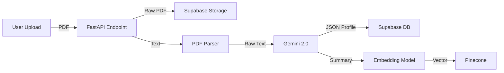

# Agent 1 - Perception 

**Agent 1** acts as the ingestion layer for the system, converting raw PDF resumes into structured, searchable data using Gemini and embedding models.

## Features

- **PDF Parsing** - Extracts raw text from uploaded resume PDFs.
- **Structured Extraction** - Uses **Google Gemini 2.0 Flash** to parse text into JSON (Skills, Education, Experience).
- **Supabase Storage** - Uploads the original PDF to S3-compatible storage and saves structured data to PostgreSQL.
- **Vector Embedding** - Generates embeddings for the candidate's experience summary and stores them in **Pinecone** for semantic search.

---

## Workflow



## Key Components

- **`tools.py`**: Handles PDF processing and calls to the Gemini API for extraction.
- **`graph.py`**: The LangGraph node that orchestrates the flow: Upload -> Parse -> Extract -> Embed -> Store.

## Data Schema (Supabase `profiles`)

```json
{
  "user_id": "uuid",
  "name": "John Doe",
  "email": "john@example.com",
  "skills": ["Python", "React", "FastAPI"],
  "experience_summary": "Senior developer with...",
  "resume_url": "https://supabase.../resume.pdf"
}
```
