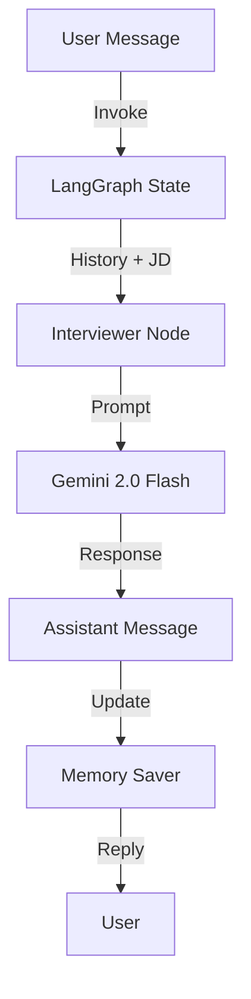

# Agent 6 - The Interviewer

**Agent 6** is a conversational AI designed to conduct technical and behavioral mock interviews. It uses **LangGraph** to maintain state and **Gemini 2.0** to generate context-aware questions and feedback.

## Features

- **Conversational State** - Remembers the entire interview history using LangGraph checkpoints.
- **Staged Flow** - Progresses logically through interview stages:
    1.  **Introduction** - Ice breaking and bio.
    2.  **Technical** - Deep dive into hard skills (Python, System Design, etc.).
    3.  **Behavioral** - Culture fit and soft skills.
    4.  **Closing** - Wrap up and feedback.
- **Context Awareness** - Tailors questions specifically to the Job Description (JD) and the candidate's previous answers.

---

## Workflow



## API Endpoint

**POST** `/api/interview/chat`

```json
{
  "session_id": "uuid-session",
  "job_context": "Senior Python Developer at Google",
  "user_message": "I have 5 years of experience with Django..."
}
```

The agent will analyze the `user_message`, determine if it's time to move to the next stage (e.g., from Tech to Behavioral), and generate the next appropriate question.
